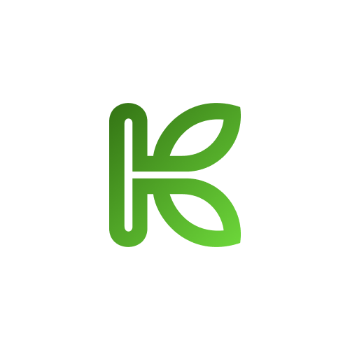
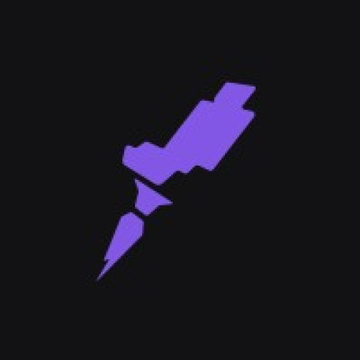
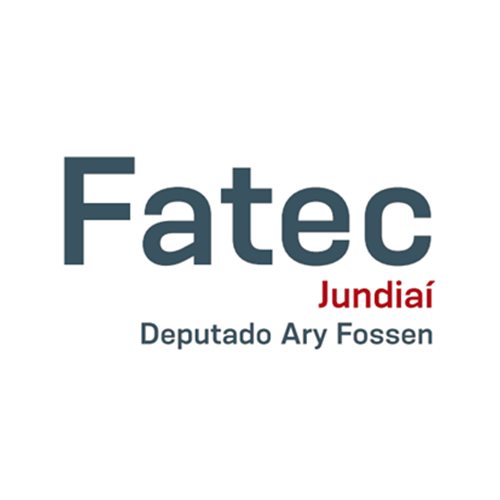

# 

- 🔥 **Front-end Developer** and **UI Designer**

- 🚀 Committed to becoming a **Full Stack Web Developer**

- ✨ Passionate about beautiful and **accessible** interfaces

- 🔭 Student of **System Analysis and Development** at [FATEC Jundiaí](https://www.linkedin.com/school/fatec-jundia%C3%AD/)

- ⚡ Fun fact **Oneye 😜**

## Professional Experience
  

**UX Designer and Front-end Developer** \
Kigos · Freelance \
<i>Jul. 2023</i> - <i>Present</i>

 

**Software Engineer** \
Lutz - Academic Management Platform · Independent \
<i>Jan. 2021</i> - <i>Present</i>

 

<!-- 

  
Formação acadêmica

  
  **Rocketseat** \
  Ignite: React.js and Node.js \
  <i>Nov. 2022</i> - <i>currently now</i>

   

  
  **ADA Tech ** \
  Web Front-end Bootcamp \
  <i>Jul. 2023</i> - <i>currently now</i>

   

  
  &nbsp;&nbsp;**FATEC de Jundiaí** \
  Graduation in System Analysis and Development \
  <i>Jan. 2022</i> - <i>currently now</i>
  
   

  
  **CPS ETEC (Centro de educação Paula Souza - ETEC de Francisco Morato)** \
  Student in System Development Technical education \
  <i>Feb. 2019</i> - <i>Dec. 2021</i>

   

 -->

## Skills

### :wrench: Tools and environments

<!-- GIT -->

### :computer: Front-End Development

### :computer: Back-End Development

  
More GitHub stats

  | </img> |
  | ----------- |
  | </img> |
  |  |

